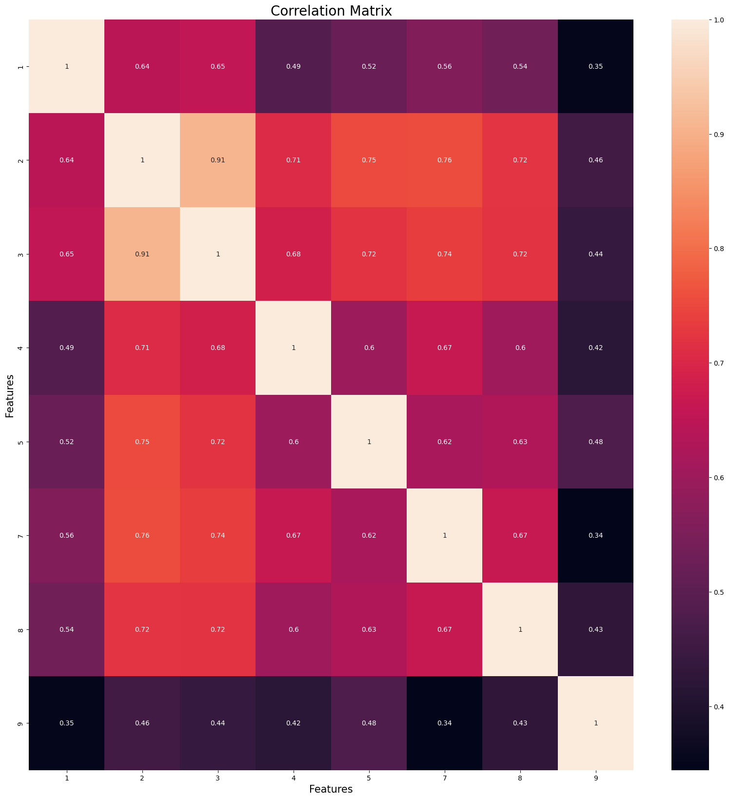
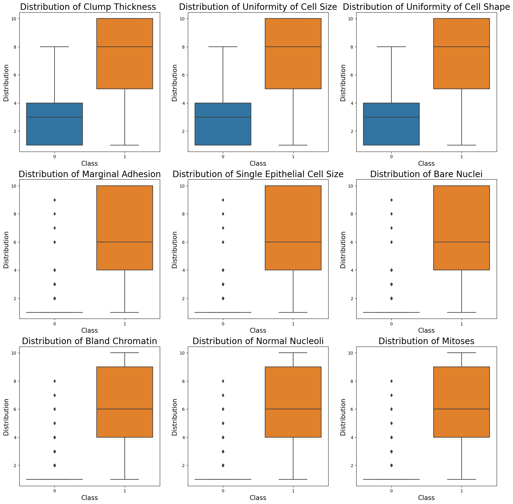
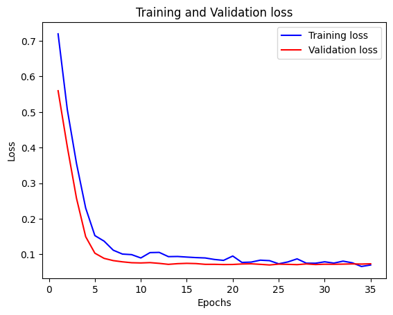
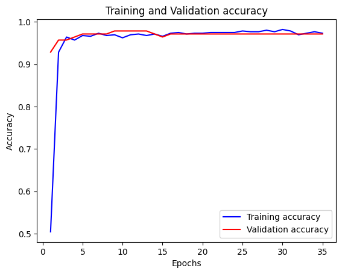
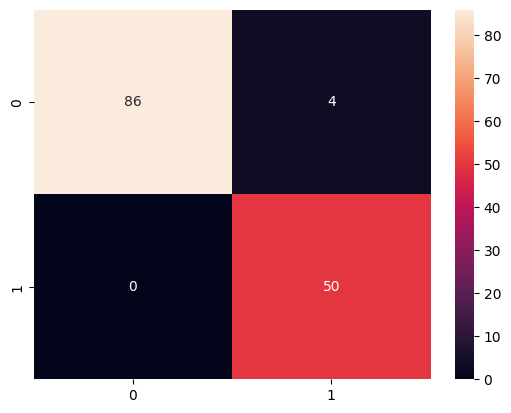

# Breast Cancer Prediction using NN
---


**─**


[**Introduction**](#introduction)

[**Preprocessing Steps**](#preprocessing-steps)

[Scalling the Datset ](#scalling-the-datset)
[Imputing Missing values](#imputing-missing-values)

[**Data Visualisation**](#data-visualisation)

[**Model Summary**](#model-summary)

[Training Loss and Accuracy](#training-loss-and-accuracy)

[**Results:**](#results)

[Confusion Matrix](#confusion-matrix)

[Other Results](#other-results)

# Introduction

To generate an an Neural Network model to predict the breast cancer type
based on dataset.

# Preprocessing Steps

## Scalling the Datset

In data analysis and machine learning, scaling is a crucial
preprocessing step that entails changing the numerical properties of a
dataset to a comparable scale. Scaling can hasten the convergence of
algorithms based on gradient descent. This is because the optimisation
method can move farther in the direction of the minimal cost function
when features are of a similar scale.Scaling\'s main goal is to prevent
characteristics with greater numerical values from dominating the
analysis and modelling process and to ensure that all features
contribute equally to it. Scaling guarantees that features with bigger
values do not dominate those with smaller values, which can help machine
learning models be more accurate. This is crucial for models that use
distance-based metrics like clustering or k-nearest neighbours.

## Imputing Missing values 

Since missing data can impair the accuracy and dependability of
statistical analyses and machine learning models, imputing missing
values is a crucial stage in the data analysis process. Ignoring missing
data can result in skewed estimations and inaccurate inferences. To
ensure that the dataset is full and that all the information is used in
the analysis or modeling, missing data are imputed. By lowering the
variance in the data, it can also increase the models\' precision and
stability. The risk of overfitting, which happens when the model is
overly complicated and matches the training data too closely, can also
be decreased with the use of imputed missing data.

Both are done using sklearn pipeline

```
num_pipeline = Pipeline(\[

(\'imputer\', SimpleImputer(strategy=\"median\")),

(\'std_scaler\', StandardScaler()),

\])
```

# Data Visualisation



Corelation matrix



**Box plot - Distribution**

# Model Summary

Model: \"sequential_5\"

\_\_\_\_\_\_\_\_\_\_\_\_\_\_\_\_\_\_\_\_\_\_\_\_\_\_\_\_\_\_\_\_\_\_\_\_\_\_\_\_\_\_\_\_\_\_\_\_\_\_\_\_\_\_\_\_\_\_\_\_\_\_\_\_\_

Layer (type) Output Shape Param \#

=================================================================

dense_15 (Dense) (None, 9) 90

dense_16 (Dense) (None, 15) 150

dropout_5 (Dropout) (None, 15) 0

dense_17 (Dense) (None, 1) 16

=================================================================

Total params: 256

Trainable params: 256

Non-trainable params: 0

\_\_\_\_\_\_\_\_\_\_\_\_\_\_\_\_\_\_\_\_\_\_\_\_\_\_\_\_\_\_\_\_\_\_\_\_\_\_\_\_\_\_\_\_\_\_\_\_\_\_\_\_\_\_\_\_\_\_\_\_\_\_\_\_\_

## Training Loss and Accuracy 




# Results:

## Confusion Matrix :



## Other Results

| Class        | Precision | Recall | f1-score | support |
|--------------|-----------|--------|----------|---------|
| 0            | 1.00      | 0.96   | 0.98     | 90      |
| 1            | 0.93      | 1.00   | 0.96     | 50      |
| accuracy     |           |        | 0.97     | 140     |
| macro avg    | 0.96      | 0.98   | 0.97     | 140     |
| weighted avg | 0.97      | 0.97   | 0.97     | 140     |
