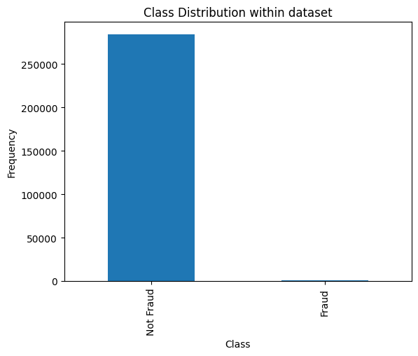
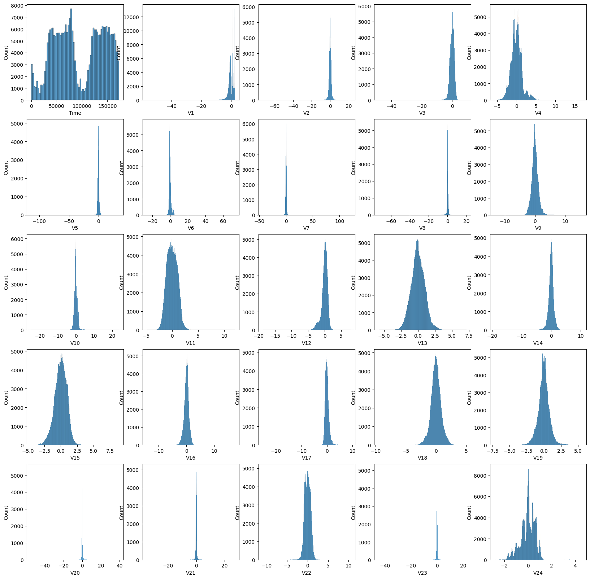
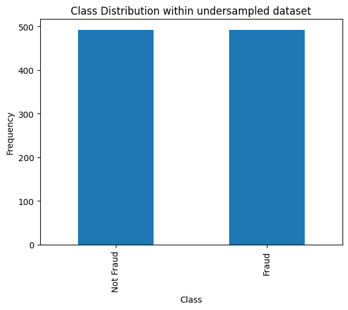
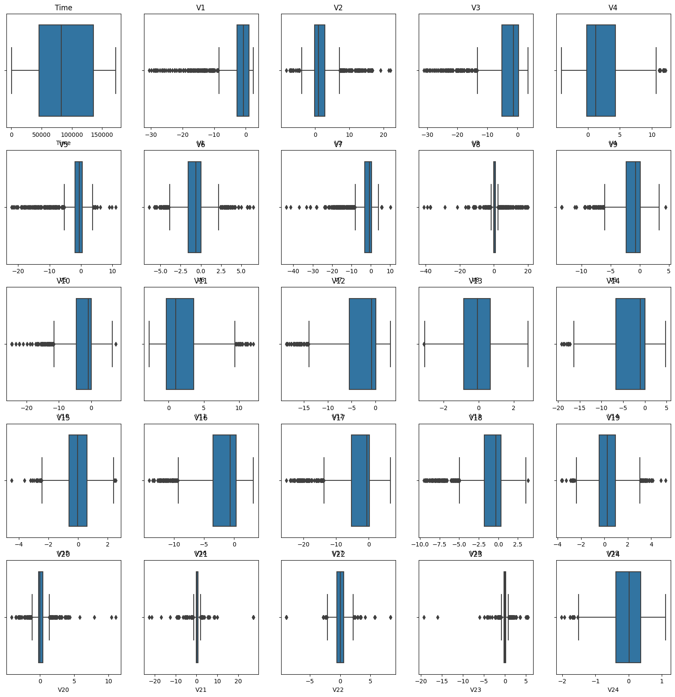
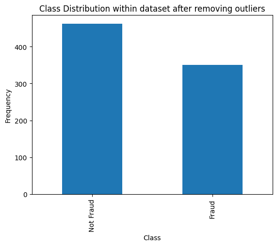
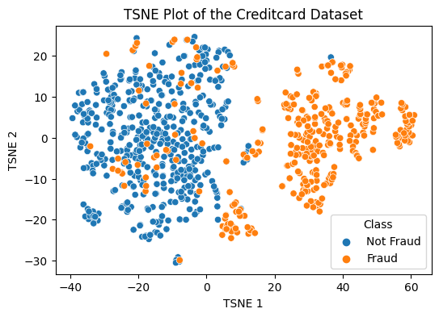
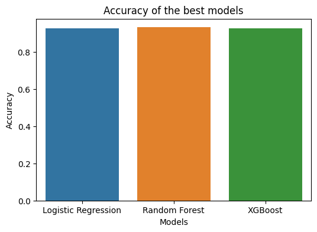
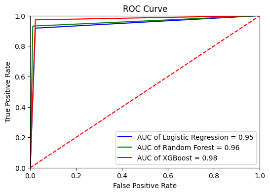
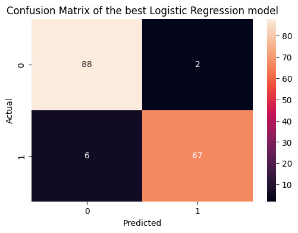
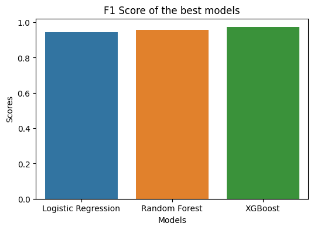

# Credit Card Fraud Detection 
---


## Motivation** 

In order to prevent customers from being charged for products they did not purchase, credit card firms must be able to identify fraudulent credit card transactions.

## Table of Contents

-   Reading the Data
-   Data Preprocessing (Clean up )
-   EDA ( Exploratory Data Analysis )
-   Dimensionality Reduction ( using Techniques like PCA )
-   Generate Classification model
-   Hyper parameter tuning
-   Results ( Accuracy, confusion matrix, f1 Score, precision and AUROC
    )


### Data Cleanup
---


Lets read the data and cleanup the data for any missing values and other
irregularities


### Exploratory Data Analysis
---


In this section we will visualise the distribution of classes and other
aspects in the given dataset






### Balancing the imbalance Dataset using Undersampling

We can observe that the dataset that we are using is not balanced, so we
will use the undersamling technique to get the reduced dataframe size
where the classes can be balanced



### Removal of Outliers 
---




To remove the outliers, lets use the IQR (interquartile range) as metric to remove outliers in current data

```
Q1 = undersampledDataset.quantile(0.25)
Q3 = undersampledDataset.quantile(0.75)
IQR = Q3 - Q1

RangeForOutliers = 4.5 * IQR
## get the indices of the rows that do not have outliers
indicesRowsWithoutOutliers = ((undersampledDataset < (Q1 - RangeForOutliers)) | (undersampledDataset > (Q3 + RangeForOutliers))).sum(axis=1) == 0

print("The number of rows that do not have outliers is ", indicesRowsWithoutOutliers.sum())

## get the dataset without outliers
datasetWithoutOutliers = undersampledDataset[indicesRowsWithoutOutliers]

print("The shape of the dataset without outliers is ", datasetWithoutOutliers.shape)
print("Number of Outliers removed in the dataset is ", undersampledDataset.shape[0] - datasetWithoutOutliers.shape[0])
```

#### PLot the distribution of the classes in the dataset without outliers



### Dimensionality Reduction
---


We will use the t-SNE fit to get the reduced number of input featues, which can distinguish the feature well.

```python
from sklearn.manifold import TSNE

tsne = TSNE(n_components=2, random_state=42)
X_main = tsne.fit_transform(X_main)
```


### Model Generation
---


#### Model 1: LOGISTIC REGRESSION


```
parametersLR = {
    "C": [0.001, 0.01, 0.1, 1, 10, 100, 1000],
    "penalty": ["l1", "l2"],
    "solver": ["liblinear", "saga"]
}
```

#### Model 2: RANDOM FOREST

```
parametersRF = {
    "n_estimators": [100, 200],
    "max_depth": [5, 10, 15],
    "min_samples_split": [2, 5],
    "min_samples_leaf": [1, 2,5]
}
```

#### Model 3: XGBOOST

```
param_grid = {
    'learning_rate': [0.01, 0.1, 0.2, 0.3],
    'max_depth': [3, 5, 7, 9],
    'subsample': [0.6, 0.7, 0.8, 0.9]
}
```

### accuracy of the best models


### ROC Curve



### Classification Report of the best Logistic Regression model

| Class        | Precision | Recall | F1-Score | Support |
|--------------|-----------|--------|----------|---------|
| 0            | 0.94      | 0.98   | 0.96     | 90      |
| 1            | 0.97      | 0.92   | 0.94     | 73      |
| accuracy     |           |        | 0.95     | 163     |
| macro avg    | 0.95      | 0.95   | 0.95     | 163     |
| weighted avg | 0.95      | 0.95   | 0.95     | 163     |


### Classification Report of the best Random Forest model

| class        | precision | recall | f1-score | support |
|--------------|-----------|--------|----------|---------|
| 0            | 0.95      | 0.99   | 0.97     | 90      |
| 1            | 0.99      | 0.93   | 0.96     | 73      |
| accuracy     |           |        | 0.96     | 163     |
| macro avg    | 0.97      | 0.96   | 0.96     | 163     |
| weighted avg | 0.96      | 0.96   | 0.96     | 163     |

### Confusion Matrices




### Comparison of the best models - F1 Scores

