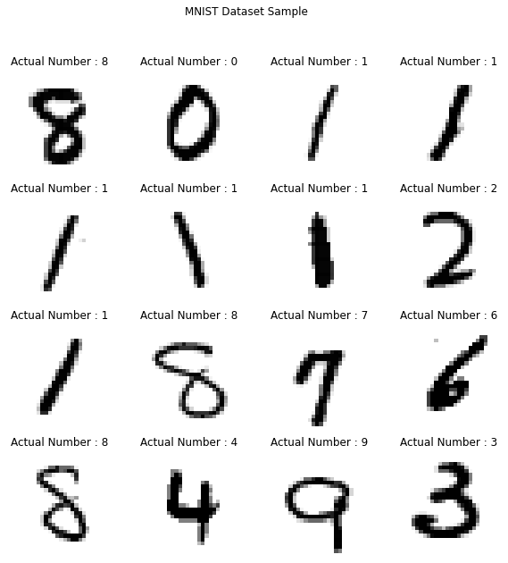
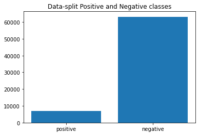
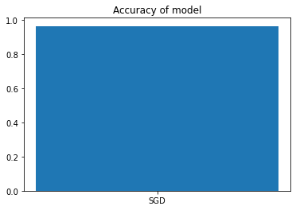
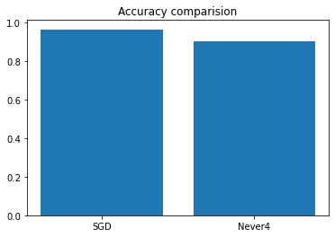
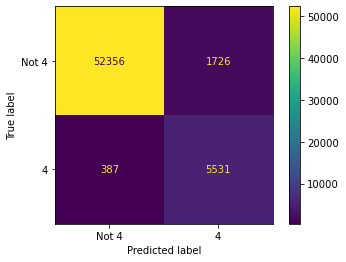
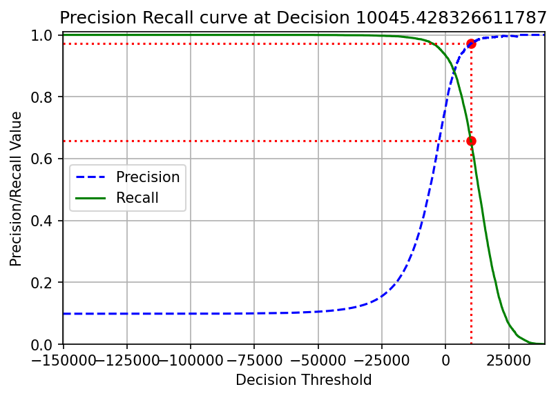
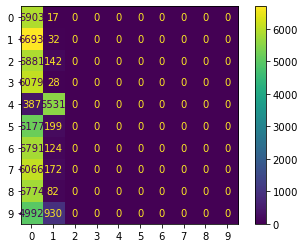

# MNIST Dataset Classification
---

Excersise from the book \"Hands on Machine Learning with Scikit 
Learn and Tensorflow\"

### Plot Digits

### Test Train Split

#### Model for Classification

Here we pick the \"Support vector classification\" model for classifying
our dataset

#### Never 4 classifier

### Confusion Matrix

### Precision Recall Curve

### MultiClass Classification {#-multiclass-classification}
#### Compute the Confusion matrix for this problem

