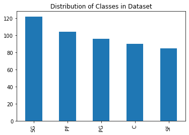
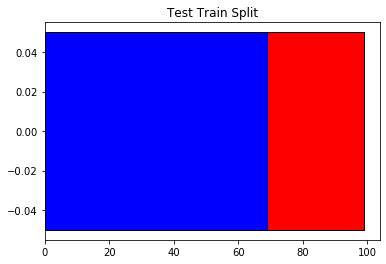
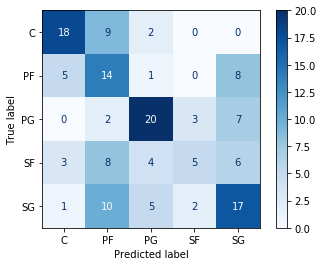
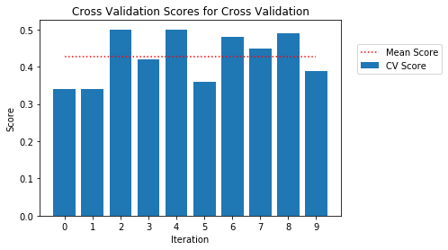
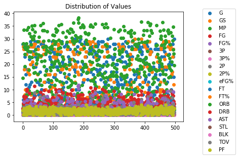
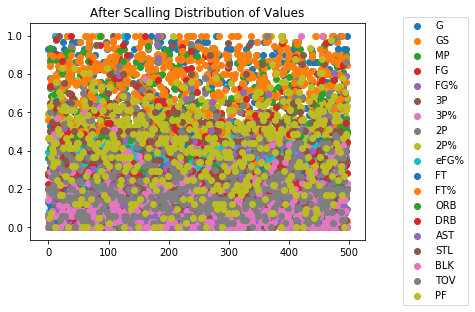

# NBA player position classification

**[Introduction](#introduction)**

**[Dataset Description](#dataset-description)**

> [Dataset Analysis ( Class Distribution
> )](#dataset-analysis-class-distribution)
>
> [Test Train Split](#test-train-split)
>
> [Label Encoding](#label-encoding)

**[Question 1 Model- SVC](#question-1-model--svc)**

> [Hyperparameters](#hyperparameters) 

> [Confusion Matrix](#confusion-matrix) 

**[Cross validation](#question-4) 4**

**[Influence of Scaling the model](#question-5) 5**

> [Scaling of Model](#scaling-of-model)

# 

# Introduction

To develop a NBA player position classification problem using the SVC

# Dataset Description 

## Dataset Analysis ( Class Distribution ) 

## Test Train Split

## Label Encoding

We have used label encoders from sklearn to convert the non numeric data
into numeric data for prediction.

# Question 1 Model- SVC

We have taken the Support vector classification model for prediction of
our problem and we have used the below hyper parameters.

## Hyperparameters

| S.No | HyperParameter | Values  |
|------|----------------|---------|
| 1    | C              | 1       |
| 2    | kernel         | sigmoid |
| 3    | gamma          | "auto"  |

The metrics obtained are

 | S.No | Validation Metric | Values |
|------|-------------------|--------|
| 1    | Accuracy          | 49%    |
| 2    | F1 Score          | 48%    |

# Confusion Matrix

It is a method for determining how well a machine learning
classification algorithm performs when the output can include two or
more classes.Confusion Matrix is a table that compares actual and
predicted values.

Confusion Matrix

  |     | 0  | 1  | 2  | 3  | 4  | 5   |
|-----|----|----|----|----|----|-----|
| 0   | 18 | 9  | 2  | 0  | 0  | 29  |
| 1   | 5  | 14 | 1  | 0  | 8  | 28  |
| 2   | 0  | 2  | 20 | 3  | 7  | 32  |
| 3   | 3  | 8  | 4  | 5  | 6  | 26  |
| 4   | 1  | 10 | 5  | 2  | 17 | 35  |
| All | 27 | 43 | 32 | 10 | 38 | 150 |

# Cross Validation

A resampling technique called cross-validation uses several data subsets
to evaluate and train a model across a number of iterations. It is
typically applied in situations where the objective is prediction and
one wishes to gauge how well a predictive model will function in
real-world situations.The process contains a single parameter, k, that
designates how many groups should be generated from a given data sample.
As a result, the process is frequently referred to as k-fold
cross-validation. When a particular number for k is selected, it may be
substituted for k in the model\'s reference, such as when k=10 is used
to refer to cross-validation by a 10-fold cross-validation.

# Metrics (Accuracy) 

The accuracy obtained in each fold is given below

 | **Iteration** | **Score**  |
|---------------|------------|
| 1             | 0.34       |
| 2             | 0.34       |
| 3             | 0.5        |
| 4             | 0.42       |
| 5             | 0.46       |
| 6             | 0.5        |
| 7             | 0.36       |
| 8             | 0.48       |
| 9             | 0.44897959 |
| 10            | 0.48979592 |
| 11            | 0.3877551  |

# Improvement of Model performance

The accuracy of the model was improved by the following methods.

-   Hyper Parameter tuning

-   Feature Selection

-   Scaling of Model

## Scaling of Model

The results were improved when we decided to scale the model using the
StandardScalar. The standard scalar will normalize the values of each
feature between 0 and 1, such that the model will not be biased by any
single parameter.

Fig Without and with Scaling

Feature Selection

We have eliminated the redundant features by removing columns which have
high correlation with each other. Further we removed columns such as age
and teams which did not have significant impact over the output of the
problem

-   Removed Age and team, since that has no correlation to the output

-   Removed columns \[\'FGA\', \'3PA\', \'2PA\', \'FTA\', \'TRB\',
    > \'PTS\'\] since they had too much correlation with another data

Hyper Parameter Tuning

we have also tuned the hyperparameters of the SVC model. The SVC
hyperparameter that were tuned are the \`kernel\`, \`C\` , \`gamma\`
values. Based on trial and error we have made sure to generate a model
which gives us consistent accuracy.

## Further Improvement

The further improvement can be done by using dimensionality reduction
techniques such as PCA , LDA and we could use complex models like Neural
Networks to increase the accuracy of the model.
